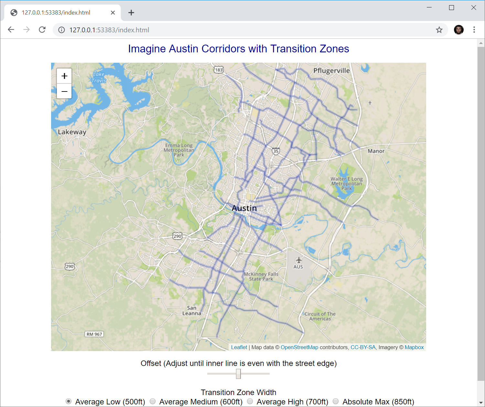

# Austin Transition Zone Vizualizer
A web app for visualizing the transition zone offsets proposed by City Council.

## DISCLAIMER
I don't work for the city. I don't have a crystal ball. I'm just a guy that wondered what 500 ft would look like vs. 600 ft, etc. All of the other info I could find seemed heavily biased toward a conclusion, and I wanted to know the facts. 

This is just going to draw lines at the distances they are discussing. 

There are lots of factors that go in to what a lot will be zoned as, and this is just one of them.

## Usage
The offsets in this tool are based on a presentation given to [Austin City Council on August 28th, 2019](http://www.austintexas.gov/department/city-council/2019/20190828-spec.htm).

It's still very much in an early state, so you have to manually provide GPS coordinates. The city publishes lots of good datasets [here](https://data.austintexas.gov/), but it's still a painful process to pull them in. Sorry in advance.

### Setup

1. Pull down the repository.
2. Change js/bounds.js to contain your desired path/coordinates.
3. Open index.html

### Usage

#### Offset
Depending on the quality of your dataset, the line on the map may or may not line up cleanly with the edge of your street. You can adjust this by sliding offset until the black line in the middle is aligned with the street at the point you're examining.

#### Street Width

City Council has stated that the width of transition zones will likely be between 500ft and 700ft, with an absolute max of 850ft. Use the readio buttons to select which of these scenarios you want to visualize.

### Reading the Map
#### Black Center Line 
Street/Offset - Use this to set the width of the street or align the data to the edge of the street if the line isn't centered

#### Green Zone
Corridor lot - This shows how far back new corridor lots would be zoned

#### Dark Blue
More intensive lots - 6 units/lot; 4-density bonus available; max 10 units with the density bonus
45' (there is a UNIT bonus but not a HEIGHT bonus

#### Light Blue
Less intensive lots - 4 units/lot; 4-density bonus available; max. 8 units with the density bonus
Base height is 35'; can have a 10' affordability bonus
